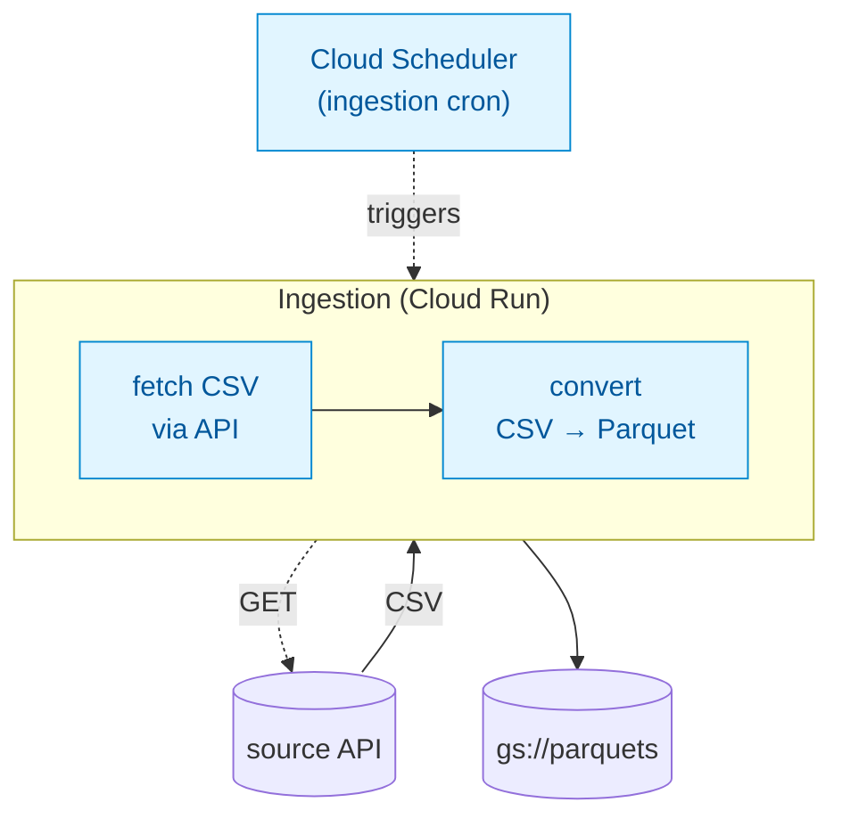
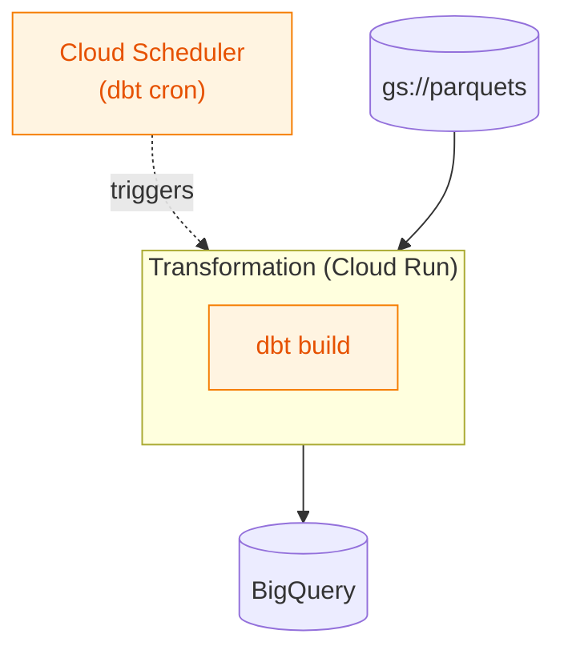
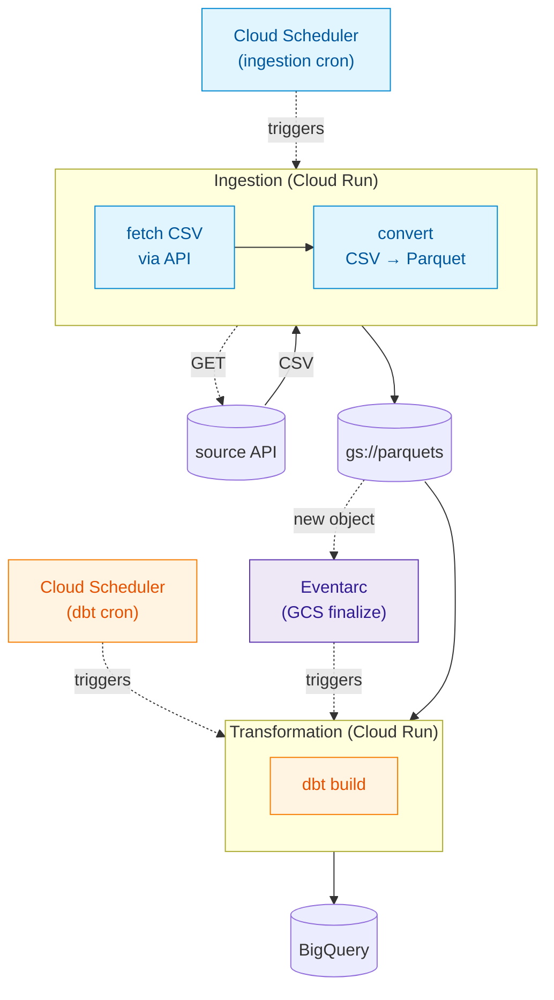

# Ingestion — Pull, Convert, Land

A scheduled Cloud Run job pulls CSV from an external API, converts it to Parquet, and appends an immutable file to a GCS bucket — giving you a durable, replayable record of every fetch.

# Transformation — Scheduled dbt Pipeline

A separate Cloud Run job runs dbt build on its own schedule, reading raw Parquet from the bucket and producing modeled tables in BigQuery. dbt knows nothing about how the files got there; it just sees a raw layer to transform.

# Independent & Orchestrated Ingestion + Transformation
Either pipeline can be redeployed, re-run, or replaced without the other knowing. And because the dbt job is decoupled, it can be wired to fire on a schedule, reactively when new Parquet lands (via Eventarc), or both.

